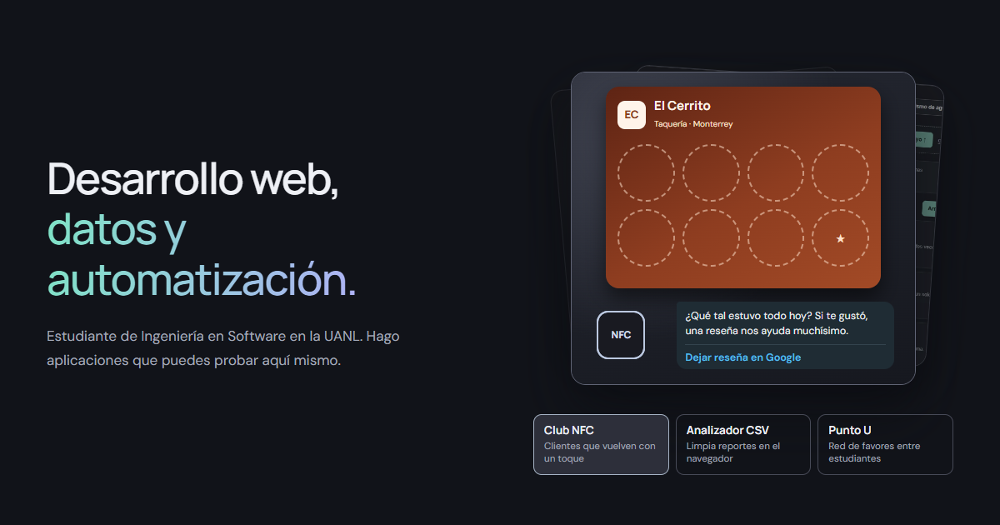

# Bruno Salas · Portafolio

[](https://github.com/Brunich/Portafolio-Web/actions/workflows/ci.yml)

**En vivo: https://bruno-portfolio-azure.vercel.app**

Estudiante de Ingeniería en Software en la UANL (2023–2028). Hago herramientas para negocios y manufactura: todas funcionan y se prueban en el portafolio, y cada una tiene su propio repositorio.



## Proyectos para negocios y manufactura

| Proyecto | Para qué sirve | Pruébalo | Código |
|---|---|---|---|
| **NFC para negocios** | Tarjeta de sellos en el celular: el cliente acerca su teléfono a un chip, suma un sello y vuelve por su premio. El mismo chip abre el menú. | [Probar](https://bruno-portfolio-azure.vercel.app/proyectos/club-nfc) | [nfc-negocios](https://github.com/Brunich/nfc-negocios) |
| **Analizador de CSV** | Limpia un reporte en un clic: duplicados, fechas mezcladas, valores mal escritos y reglas rotas. Lo grafica y responde consultas SQL. | [Probar](https://bruno-portfolio-azure.vercel.app/proyectos/analizador-csv) | [analizador-csv](https://github.com/Brunich/analizador-csv) |
| **Planta: consolidador y OEE** | Cruza producción, calidad y paros; marca las incoherencias y calcula el OEE de cada línea. Saca el reporte en Excel. | [Probar](https://bruno-portfolio-azure.vercel.app/proyectos/planta) | [planta-oee](https://github.com/Brunich/planta-oee) |
| **Gráficas de control (SPC)** | Dice si la máquina se está desajustando antes de que salga pieza mala, con Cp y Cpk. **App de escritorio para Windows.** | [Probar](https://bruno-portfolio-azure.vercel.app/proyectos/graficas-de-control) · [Descargar](https://github.com/Brunich/graficas-de-control/releases/latest) | [graficas-de-control](https://github.com/Brunich/graficas-de-control) |
| **Inventario con la cámara** | La cámara del celular como lector de códigos: entradas, ventas, conteo y lista para el proveedor. | [Probar](https://bruno-portfolio-azure.vercel.app/proyectos/inventario) | [inventario-camara](https://github.com/Brunich/inventario-camara) |
| **Entrega de turno** | Las incidencias de calidad pasan de un turno a otro con responsable, foto de evidencia y cierre. | [Probar](https://bruno-portfolio-azure.vercel.app/proyectos/entrega-de-turno) | [entrega-de-turno](https://github.com/Brunich/entrega-de-turno) |

## En desarrollo

| Proyecto | Qué será |
|---|---|
| **Asistente de IA local** | Atiende clientes y consulta la base interna con un modelo abierto instalado en el negocio: sin pagar por mensaje y sin que los datos salgan. [Ver la demo](https://bruno-portfolio-azure.vercel.app/proyectos/asistente-ia-local). |
| **Portal de empleados** | Cada empleado con su cuenta y su foto: peticiones, documentos y avisos, con bloqueo por intentos fallidos, segundo paso y aviso de privacidad. |
| **Apps Android nativas** | NFC para negocios, Inventario y Entrega de turno como apps de Android, con el lector NFC, la cámara y las notificaciones del teléfono. |

## Otros códigos

| Proyecto | Qué es | Enlace |
|---|---|---|
| **VibeMap** | Hackathon, equipo de 3: cualquier proyecto de código como mapa mental. | [En vivo](https://vibemap-brunich.vercel.app) · [VibeMap](https://github.com/Brunich/VibeMap) |
| **Punto U** | Favores entre estudiantes de la UANL en un mapa del campus. Web y Android. | [En vivo](https://punto-u-app.vercel.app) · [Punto-U-app](https://github.com/Brunich/Punto-U-app) |
| **IA Rogue** | Game dev: roguelike 3D en Godot; en el portafolio, el comparador de estilos y la galería. | [Game dev](https://bruno-portfolio-azure.vercel.app/#graphics) |

Tengo más proyectos, pequeños y grandes, en [github.com/Brunich](https://github.com/Brunich).

## Correr y probar

```bash
npm install
npm run dev          # http://127.0.0.1:5173
npm run test:unit    # lógica de cada proyecto (node:test)
npm test             # recorridos y accesibilidad con Playwright + axe
```

Los datos de ejemplo son inventados y de empresas ficticias. La procedencia de cada imagen está en [`public/media/SOURCES.md`](public/media/SOURCES.md).

## Licencia

[MIT](LICENSE). Úsalo, cámbialo y compártelo; sólo conserva el aviso de copyright.
